# Motivation
1. A process is the unit of work in most systems.
2. Operating-system processes execute system code, and user processes execute user code. All these processes may execute concurrently.
3. Modern OS supoort processes having mulitple threads of control. On systems with multiple hardware processing cores these threads can run in parallel.
4. One of the most important aspects of an OS is how it schedules threads onto available processing cores. There are several choices available to programmers.
5. Early computers allowed only one process to run at any given time. But the contemporary computer systems allow mulitple programs to be loaded into memory and executed concurrently.
6. And this resulted in the notion of what we call as `process`.
7. So, a system in essence consists of a collection of processes, some executing user code, others executing operating system code.
# Process Concept
1. In time-shared systems with multi user, there are can many processes. And even in a single-user time, a user can execute various applications all at once.
2. The term job has historical significance due to the fact that OS theory and terminology was developed during a time when the major activity of operating systems was job processing.
## The Process
1. A Process is a program in execution.
2. The status of the current activity of a process is represented by the value of the `program counter` and the contents of the processor's registers.
3. The memory layout of a process generally involves the following structure:
    1. Text section - the executable code
    2. Data section - global variables, initialized (BSS, block started by symbol) and uninitialized data
    3. Heap section - memory that is dynamically allocated during program runtime
    4. Stack section - temporary data storage when invoking functions (such as function parameters, return addresses, and local variables)

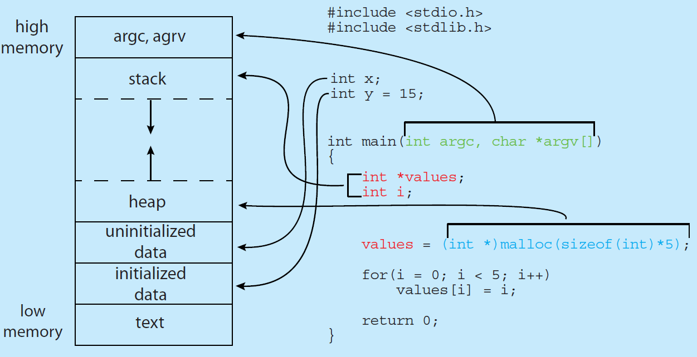

4. The size of text and data sections are fixed, as their sizes do not change during program runtime. However, the stack and heap sections can shrink and grow dynamically during program execution.
5. Each time a function is called, an activation record containing function parameters, local variables, and the return address is pushed onto the stack; when control is returned from the function, the activation record is popped from the stack.
6. The OS ensures that heap and stack don't overlap each other.
7. A Program is a passive entity which is just sitting on the disk. Whereas, a process is a active entity which is currently in execution.
8. A program becomes a process when an executable file is loaded into memory.
9. A Process may call another process to execute. For example, in Java, the JVM is a process that actually intreprets the Java Program.
## Process State
1. As a process executed, it changes state.
2. A process may be in one of the following states:
    1. New - The process is being created
    2. Running - Instructions are being executed
    3. Waiting - The process is waiting for some event ot occur (such as an I/O completion or reception of a signal).
    4. Ready - The process is waiting to be assigned to a processor.
    5. Terminated - The Process has finished execution

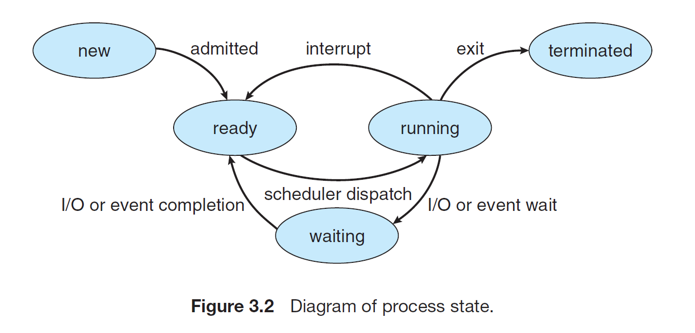

3. Only one process may be in running state inside the processor. But many processes can be ready or waiting state.

## Process Control Block
1. Each process is represented in the operating system by a `process control block (PCB)` - also called a `task control block (TCB)`
2. It contains various information about the process such as:
    1. Process state - The state may be new, ready, running, waiting, halted and so on.
    2. Program Counter - The counter indicates the address of the next instruction to be executed for this process.
    3. CPU registers - The registers vary in number and type, depending on the computer architecture (like x86, AMD etc). They include accumulators, index registers, stack pointers and general-purpose registers, plus any condition-code information. This information is important to allow the process to be continued correctly afterwards when it is rescheduled to run.
    4. CPU-scheduling information - This information includes a process priority, pointers to scheduling queues, and any other scheduling parameters.
    5. Memory-management information - This information may include such items as the value of the base and limit registers and the page tables, or the segment tables, depending on the memory system used by the operating system.
    6. Accounting information - It includes the amount of CPU and real time used, time limits, accound numbers, job or process numbers and so on.
    7. I/O status information - It includes the list of I/O devices allocated to the process, a list of open files and so on.

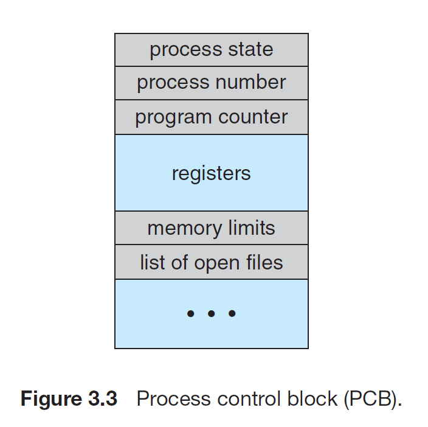

In brief, the PCB simply serves as the repository for all the data needed to start, or restart, a process, along with some accounting data.

> More information: The process contol block in the Linux operating system is represented by the C structure `task_struct`, which is found  in the `<include/linux/sched.h>` include file in the kernel source-code directory. For the fields of this struct are given below:
```c
long state; // state of the process
struct sched_entity se; // scheduling information
struct task_struct *parent // this process's parent
struct list_head children; // this process's children
struct files_struct *files; // list of open files
struct mm_struct *mm; // address space
```
> As we can see, it contains important information like state of the process, scheduling and memory-management information, list of open files and pointers to the process's parent and a list of its children and siblings.

> Within the Linux Kernel, all active processes are represented using doubly linked list of `task_struct`. The kernel maintains a pointer-`current`-to the process currently executing on the system, as shown below:
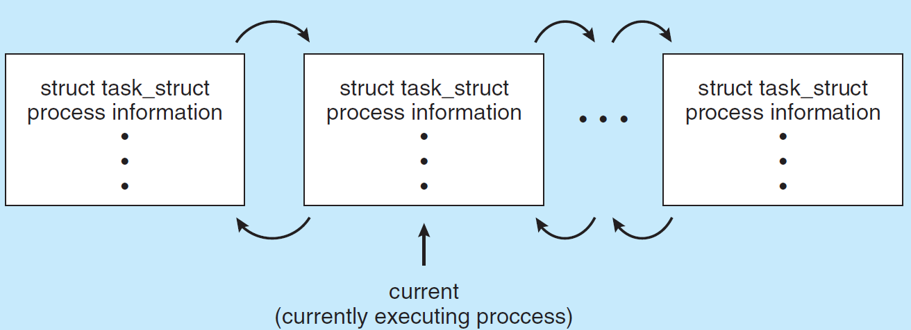

## Threads
1. A process is a program that performs a single thread of execution. For example, when a process is running a word-processor program, a single thread of instructions is being executed.
2. This single thread of control allows the process to perform only one task at a time.
3. However, most modern operating systems have extended the process concept to allow a process to have multiple threads of execution and thus to perform more than one task at a time.
4. This feature is especially benefical on multicore systems, where multiple threads can run in parallel. Like for example, a multithreaded word processor could, assign one thread to manage user input while another thread runs the spell checker.
5. On systems that support threads, the PCB is expanded to include information for each thread
# Process Scheduling
1. We must always have maximum CPU utilization.
2. The objective of time sharing is to switch a CPU core among processes so frequently that users can interact with each program while it is running.
3. For that, the process scheduler selects an available process (possibly from a set of several available processes) for program execution on a core. Because each CPU core can run one process at a time.
4. For a system with a single CPU core, there will never be more than one process running at a time, whereas a multicore system can run multiple processes at one time.
5. If there are more processes than cores, excess processes will have to wait until a core is free and can be rescheduled. The number of processes currently in memory is known as the `degree of multiprogramming`
6. For our objective of multiprogramming and time-sharing, the process can be generalized into I/O bound or CPU-bound. I/O bound processes makes frequent I/O requests and less CPU time whereas CPU bound processes make less I/O requests and takes more CPU time.
## Scheduling Queues
1. As processes enter the system, they are put into a `ready queue`, where they are ready and waiting to execute on a CPU's core.
2. The queue is generally stored as a linked-list, a ready-queue header contains pointers to the first PCB in the list, and each PCB includes a pointer field that points to the next PCB in the ready queue.
3. There are other queues as well, such as for processes that are waiting for the I/O devices are placed in a `wait queue`.

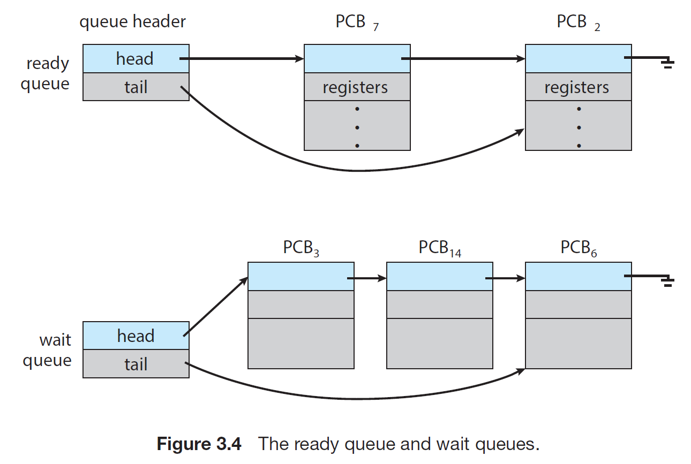

The common way to understand process scheduling is via the `queueing diagram` such as that in the below figure:

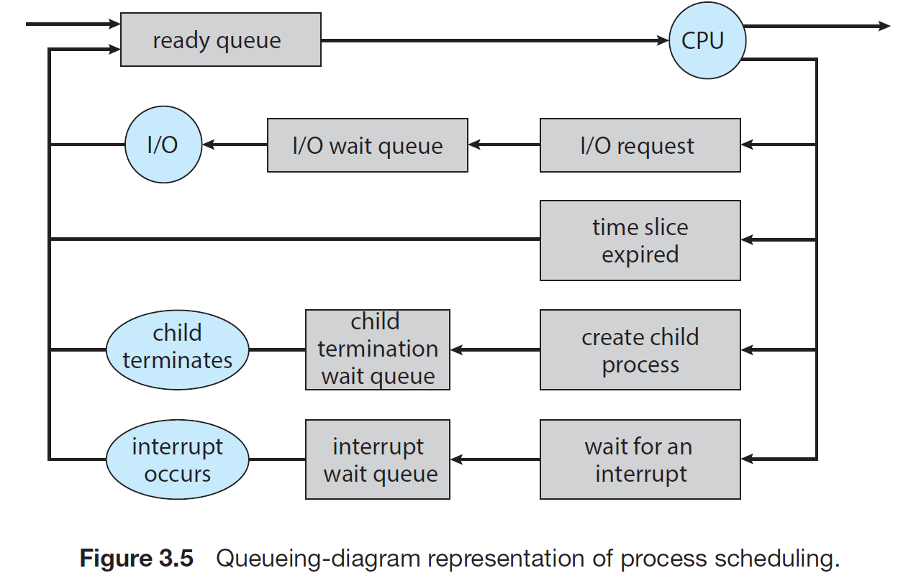

A new process is initially put in the ready queue. It waits there until it is selected for execution, or dispatched. Once the process is allocated a CPU core and is executing, one of several events could occur:

    1. The process could issue an I/O request and then be placed in an I/O wait queue.
    2. The process could create a new child process and then be placed in a wait queue while it awaits the child's termination.
    3. The process could be removed forcibly from the core, as a result of an interrupt or having its time slice expire, and be put back in the ready queue.

In the first two cases, the process will be placed in the ready state queue once the wait is done. In the third case, the process is directly put in the ready state. A process continues this cycle until it terminates, at which time it is removed from all queues and has its PCB and resources deallocated.

## CPU Scheduling
1. The role of the `CPU scheduler` is to select from among the processes that are in the ready queue and allocate a CPU core to one of them.
2. The CPU scheudluer must select a new process for the CPU frequently and must not keep the CPU idle.
3. When the main memory is overcommitted with the processes, the scheduler might swap out some processes to disk, where it's data is stored and when it's free again it will bring the process back by swapping in. This process is known as `swapping`
## Context Switch
1. Switching the CPU core to another process requires performing a state save of the current process and a state restore of a different process. This task is known as a `context switch`.
2. As we saw earlier, the `context` of a process is saved on the PCB. It includes the value of the CPU registers, the process state and memory-management information.
3. There is always a overhead in `context switching` and the switching speed varies from machine to machine, depending upon memory speed, the number of registers that must be copied, and the existence of special instrutions (such as a single instruction to load or store all registers).

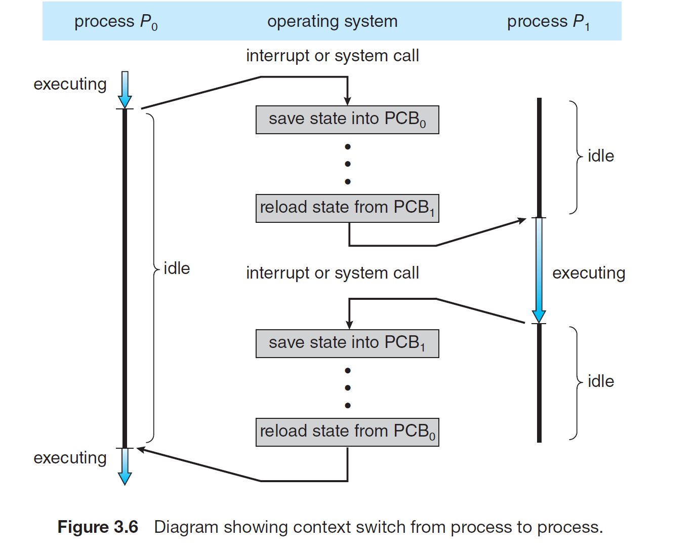

# Operations on Processes
The processes in most systems can execute concurrently, and they may be created or deleted dynamically. Thus, these systems must provide a mechanism for process creation and termination.

## Process Creation
1. A process that creates more processes of it's own becomes the parent process and the process it created becomes child processes. Also, each of these child processes may in turn create other processes, forming a `tree` of processes.
2. Most OS assign a `Process Identifier` or (PID) to each process. Which is used as an index to access various attributes of a process within the kernel.
3. For the Linux OS, the `systemd` task (yes, linux uses name task instead of process) serves as the root parent process for all user processes, and is the first user process created when the system boots.

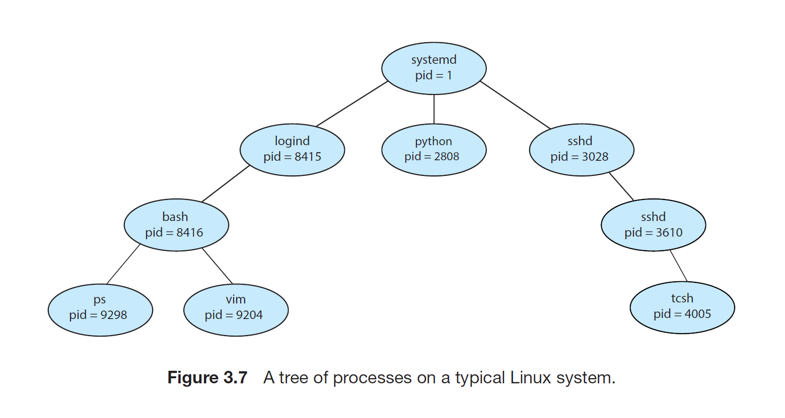

4. In general, when a process creates a child process, that child process will need certain resources (CPU time, memory files, I/O devices) to accomplish its task.
5. A child process can either ask the resources from the OS or it can ask from it's parent process.
6. If it ask from the parent process then, the parent may have to partition its resources among its children, or it may have to share some resources among several of its children.
7. The above method, that is restricting a child process to a subset of parent's resources prevents any process from overloading the system by creating too many child processes.
8. Parent process may in some case have to pass some initialization data (input) to the child process.
9. When a process creates a new process, two possibilities for execution exist:
    1. The parent continues to execute concurrently with its children.
    2. The parent waits until some or all of its children have terminated.
10. There are also two address-space possibilities for the new process:
    1. The child process is a duplicate of the parent process ( it has the same program and data as the parent)
    2. The child process has a new program loaded into it.
11. In UNIX-system a new process is created by `fork()` system call. And the new process consists of a copy of the address space of the original process. This always easy communication between parent and child process.
12. Both the processes continue execution at the instruction after the fork(), with one difference: the return code for the `fork()` is zero for the new (child) process, whereas the (nonzero) process identifier of the child is returned to the parent.
13. The child process can either continue executing the same program as was forked from the parent process, or else, it can totally run a different program by executing the `exec()` system call, which essentially destroys the current memory image and loads the binary file of the new program.
14. The parent can either create more children, or else wait for the children to complete if it has nothing to do by issusing `wait()` system call.

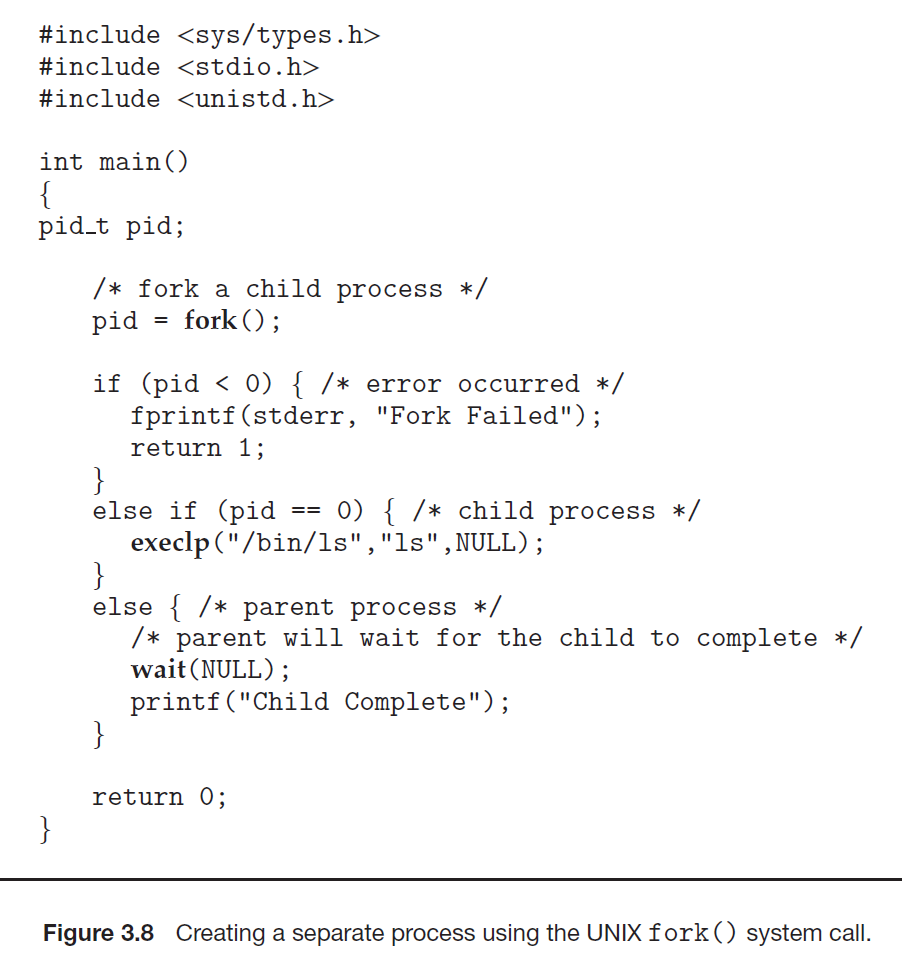

## Process Termination
1. Whenever the process wants to terminates it issues an `exit()` system call and the waiting parent (via `wait()` system call) reads the return status value. After which all the resources are deallocated.
2. Also, termination of a child process by the parent process is also allowed. A parent may terminate the execution of one of its children for a variety of reasons, such as these:
    1. The child has exceeded its usage of some of the resources that it has been allocated.
    2. The task assigned to the child is no longer required
    3. The parent is exiting, and the operating system does not allow a child to continue if its parent terminates.

3. Some systems use `cascading termination` i.e. is a process terminates then all its children must also be terminated.
4. A parent process may wait for the termination of a child process by using the `wait()` system call. The `wait()` system call is passed a parameter that allows the parent to obtain the exit status of the child. This system call also returns the process identifier of the terminated child so that the parent can tell which of its children has terminated.

On Child process side
```c
...
/* exit with status 1 */
exit(1);
```
On parent process side
```c
pid_t pid;
int status;

pid = wait(&status);
```
5. When a process terminates it's entry is still left in the process table, because it contains the process's exit status.
6. A process that has terminated, but whose parent has not yet called `wait()` is known as a `zombie` process. All processes transition to this state when they terminate, but generally they exist as zombies only for brief amount of time. Once the parent calls `wait()`, the process identifier of the zombie process and its entry in the process table are released.
7. If on the other hand if the parent process didn't call `wait()` and instead terminated, thereby leaving its child process as `orphans`. Such processes are adopted by the `systemd` process, and it takes good care of them.

# Interprocess Communication
1. Any process that shares data with other processes is a cooperating process.
2. Cooperating processes require an `interprocess communication (IPC)` mechanism that will allow them to exchange data.
3. There are two fundamental model of IPC:
    1. Shared Memory - A shared region in memory is used to read and write data.
    2. Message Passing - Messages are exchanged b/w two cooperating processes.

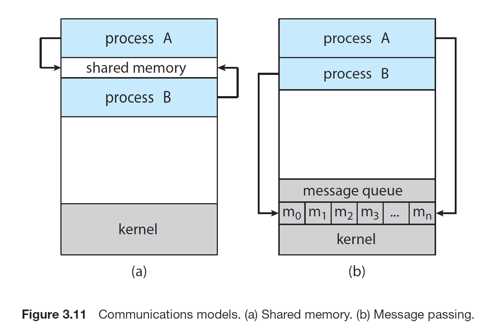
4. Shared Memory IPC is more quick and doesn't require much kernel/ system calls. It is good for large data exchange
5. Message Passing is used for smaller data but more kernel/system call are required hence making them slower.

# IPC in Shared-Memory Systems
1. Typically, a shared-memory region resides in the address space of the process creating the shared-memory segment.
2. Other processes that wish to communicate using this shared-memory segment must attach it to their address space.
3. Also, the Shared memory assumes that the restriction between accessing a part of other process is also removed for it to work.
4. It is the duty to the processes to ensure no processes writes simultaneously to the same location.
5. Let's study an example of producer-consumer process,

let's assume that the following part of the memory/variables are located in the shared memory
```c
#define BUFFER_SIZE 10

typedef struct {
    ...
} item;

item buffer[BUFFER_SIZE];
int in = 0;
int out = 0;
```

The Code for the Producer Process will be as follows:
```c
item next_produced;

while(true) {
    // produce an item
    
    while(((in + 1) % BUFFER_SIZE) == out); // do nothing because buffer is full

    buffer[in] = next_produced;
    in = (in + 1) % BUFFER_SIZE;
}
```

The code for the Consumer Process will be as follows:
```c
item next_consumed;

while(true) {
    while(in == out); // do nothing because the buffer is empty

    next_consumed = buffer[out];
    out = (out + 1) % BUFFER_SIZE;

    // consume the item
}
```

This type of model with these many variables can only store BUFFER_SIZE - 1 items inside it.
Because of the fact inside the producer, we have used `(in + 1) % BUFFER_SIZE == out` in the while condition.
It's done because, if had used `in % BUFFER_SIZE == out` instead then there would not be any distinction as to if the buffer is full or empty, both condition would have got same result and hence would have become ambiguous.

By adding `size` variable to our current model we can use `BUFFERSIZE` locations.

# IPC in Message-Passing Systems
1. Unlike shared-memory model, where the code of the shared memory must be explicitly written by the application programmer, In message-passing we use the services provided by the OS.
2. It is useful in distributed environment, where the communicating processes may reside on different computers connected by a network.
3. It provides atleast two operations:
    1. send(message) and 
    2. receive(message)
4. The messages can be fixed or variable in size.
5. The logical communication link can be of the following type:
    1. Direct/Indirect Communication
    2. Synchronous/Asynchronous Communication
    3. Automatic/Explicit Buffering

## Direct/Indirect Communication
1. Each process that wants to communicate must explicitly name the recipient or sender of the communication.
    * send(P, message) - send a message to process P
    * receive(Q, message) - receive a message from process Q
2. Between each pair of processes, there exist exactly one link.
3. The above was the example for the symmetrix addressing where both the process must name each other.
4. In asymmetric addressing only the sender names the recipient, and the receiver is not required to name the sender as
    * send(P, message) - Send a message to process P
    * receiver(id, message) - Receiver a message from any process. The variable id is set to the name of the process with which communication has taken place.
5. Too much hard coding involved as all the identifiers must be explicitly stated.
## Indirect Communication
1. The messages are sent to and received from `mailboxes` or `ports`.
2. A mailbox can be viewed abstractly as an object onto which messages can be placed by processes and from which messages can be removed.
3. Each mailbox has a unique identification.
4. A Process can communicate with another process via a number of different mailboxes.
5. The operations are defined as follows:
    * send(A, message) - Send a message to mailbox A.
    * received(A, message) - Receive a message from mailbox A.
6. Suppose if the processes P1,P2 and P3 all share mailbox A. Process P1 sends a message to A, while both P2 and P3 execute a receive() from A. Who will read the message depends on the method used:
    * Allow a link to be associated with two processes at most, so either P2/P3 can join mailbox A in the first place
    * All at most one process at a time to execute a receive() operation.
    * Allow system to schedule the receive operation turnwise like round robin.
7. A mailbox may be owned either by a process or by the operating system. If the mailbox is owned by the process (the mailbox is part of the address space of the process), then we distinguish between the owner (which can receive message throught this mailbox) and the user (which can only send messages to the mailbox). The owners are always unique.
8. When a process that owns a mailbox terminates, the mailbox disappears. Any process that subsequently sends a message to this mailbox must be notified that mailbox no longer exists now.
9. Mailbox owned by OS are maintained by the OS and are independent.
## Synchronization
1. Message passing may be either blocking or nonblocking
    * Blocking send - The sending process is blocked until the message is received by the receiving process or by the mailbox.
    * Nonblocking send - The sending process sends the message and resumes operation
    * Blocking receive - The receiver blocks until message is available
    * Nonblocking receive - The receiver retrieves either a valid message or a null.
2. Different combinations are possible. When both send() and receive() are blocking, we have a rendezvous between the sender and receiver.
## Buffering
1. Communication link can even be thought as an queue, and it can be of three types
    * Zero Capacity: The link cannot have any messages waiting in it. The sender must block until the recipient receives the message.
    * Bounded Capacity: The queue has finite length n, thus at most n messages can reside in it. If the queue is not full when a new message is sent, the message is placed in the queue, and the sender can continue. If the queue is full then the sender must block untill space is available in the queue.
    * Unbounded Capacity: The queue has infinite length. The sender never blocks.
2. The zero-capacity case is sometimes referred to as a message system with no buffering. The other cases are referred to as system with automatic buffering.

# Examples of IPC
## Pipes
1. In implementing a pipe, four issues must be considered:
    * Does the piple allow bidirectional communication or unidirection
    2. It is half-duplex or full duplex
    3. Should the communicating process be parent-child
    4. Can the pipes communicate over a network, or must communicating processes reside on the same machine.
### Ordinary Pipes
1. These are unidirection pipe, with one write end and read end.
2. For bidirectional communication two pipes must be used.
3. In UNIX pipes are constructed as:
`pipe(int fd[])`
This function creates a pipe that is accessed through the int fd[] file descriptors: fd[0] is the read end of the pipe, and fd[1] is the write end. UNIX treats a pipe as a special type of file. Thus, pipes can be accessed using ordinary read() and write() system calls.
2. Ordinary pipe can only be used by the child processes of the process and not outside of it.
3. The child process inherits pipes from its parent process, same as other open files from its parent.
4. If the parent process is sending, it will close the read end and the child process will close the write end before using the pipe.

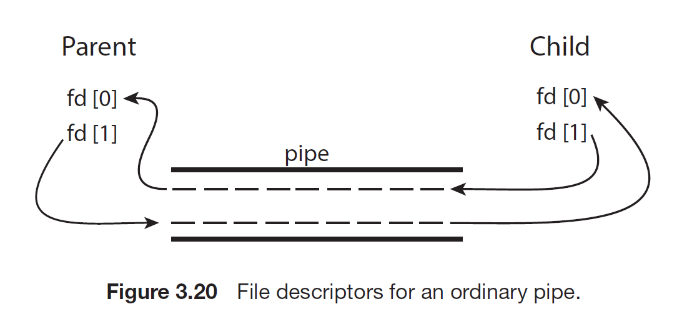
### Named Pipes
1. They are more powerful communication tool. They can be bidirectional and no parent-child relationship is required.
2. Once a named pip is established, several processes can use it for communication. They are referred to as FIFOs in UNIX systems. And supports `mkfifo`, `open`, `close`, `read` and `write` system calls.
# Communication across network
## Sockets
1. A socket is identified by an IP address concatenated with a port number.
2. The server waits for incoming client requests by listening to a specified port. Once a request is received, the server accepts a connection from the client socket to complete the connection.
3. There are well-known port numbers like SSH (22), HTTP(80), HTTPS(443) they are all below 1024
4. Each socket is unique in the sense that it is identified by four entities:
    * Source IP address
    * Source Port Number
    * Destination IP address
    * Destination Port Number
5. Sockets can be connection-oriented (TCP) or connectionless (UDP).
## Remote Procedure Calls
1. The messages exchanged in RPC communication are well strutured and are thus no longer just packets of data.
2. Each message is addressed to an RPC daemon listening to a port on the remote system, and each contains an identifier specifying the function to execute and the parameters to pass to that function.
3. The function is then executed as requested and any output is sent back to the requester in a separate message.
4. Basically, every service here will have some port number to differentiate it from the others.
5. For instance, if a system wished to allow other systems to be able to list its current users, it would have a daemon supporting such an RPC attached to a port - say, port 3027. Any remote system could obtain the needed information (the list of current users) by sending an RPC message to port 3027 on the server.
6. In a nutshell, we are calling a function() which is present remotely and passing it some value and reading the returned value from its reply.
