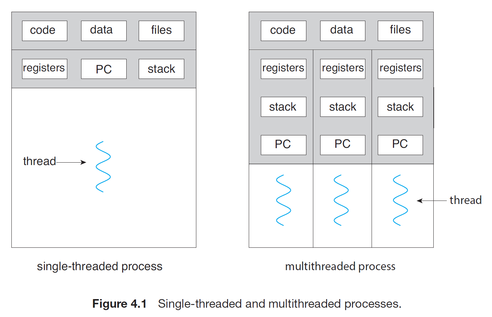

# Motivation
1. A thread is a basic unit of CPU utilitization; it comprises a thread ID, a program counter (PC), a register set, and a stack.
2. It shares with other threads belonging to the same process its code section, data section, and other operating-system resources, such as open files and signals.
3. If a process has single thread of control then it can only perform a single task at a time, but if a process has multiple thread of control then it can perform multiple task at a time.

4. The application of threads can be seen in the case of Web-Server. Early web-servers used to run a single threaded process. It was all good and fun for a single client. But if more than one client wanted to connect then the other clients had to wait for a all time before their turn came. The other solution was to run a dedicated single threaded process for each client on the server. But since we know from the pre
