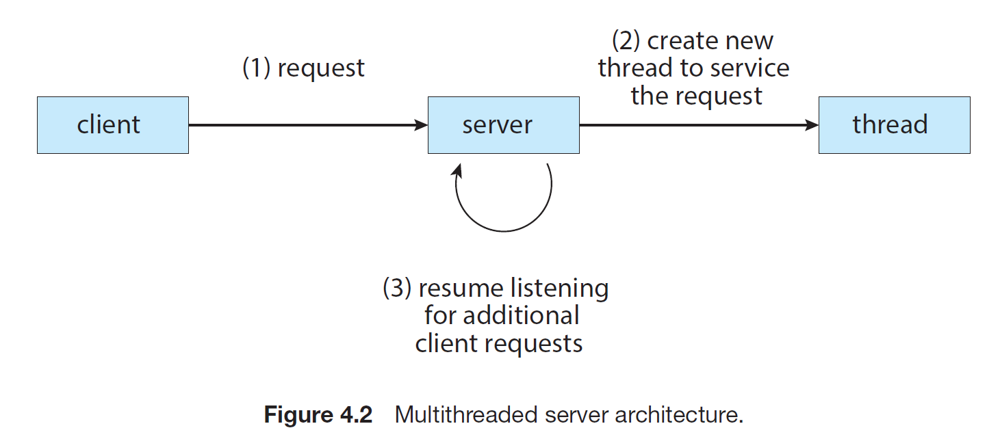
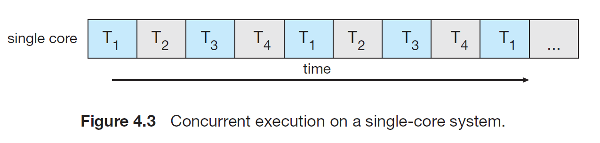
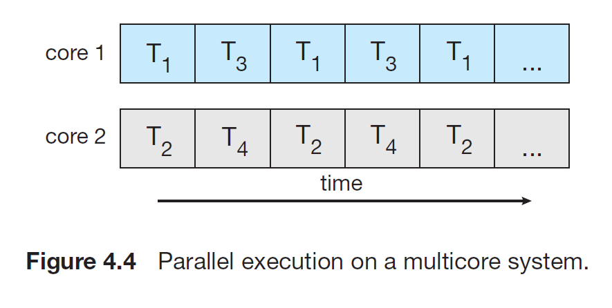
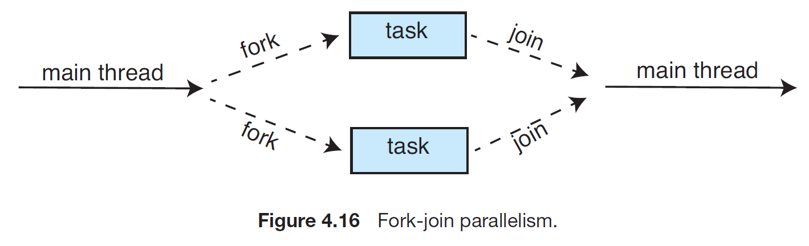

# Motivation
1. A thread is a basic unit of CPU utilitization; it comprises a thread ID, a program counter (PC), a register set, and a stack.
2. It shares with other threads belonging to the same process its code section, data section, and other operating-system resources, such as open files and signals.
3. If a process has single thread of control then it can only perform a single task at a time, but if a process has multiple thread of control then it can perform multiple task at a time.

4. The application of threads can be seen in the case of Web-Server. Early web-servers used to run a single threaded process. It was all good and fun for a single client. But if more than one client wanted to connect then the other clients had to wait for a all time before their turn came. The other solution was to run a dedicated single threaded process for each client on the server. But since we know from the process creation takes alot of overhead and time and resources so, it is still not an effective solution for large amount of client. And besides since the process is going to perform the same task so no point of spawning new processes each time a client wants to connect.    
A different strategy for such type of problem could be create a multithreaded process. When a request is made, rather than creating another process, the server creates a new thread to service the request and resumes listening for additional requests.

5. Most OS kernels are alos typically multithreaded. During system boot time on Linux systems, several kernel threads are created. Each thread performs a specific task, such as managing devices, memory management, or interrupt handling. `kthreadd` with PID = 2 serves as the parent of all other kernel threads.
6. Programmers who must solve contemporary CPU-intensive problems in data mining, graphics, and artifical intelligence can leverage the power of modern multicore systems by designing solution that run in parallel.
## Benefits
The benefits of multithreaded programming can be borken down into four major categories:
1. Responsiveness: If the time-consuming operation is performed in a seperate, asynchronous thread and some other thread which is active and interacting with the user, the application as a whole remains responsive.
2. Resource sharing: Processes can share resources only via shared memory or message passing techniques. These things needs to be explicitly arranged by the programmer. However, threads share the memory and the resources of the process to which they belong by default. All the threads of the process runs within the same address space.
3. Economy: Allocating memory and resources for process creation is costly. Since, threads share the resources of the process to which they belong, it is more economical to create and context-switch threads. Context-switching in threads is typically faster than between processes.
4. Scalability: The prime benefit of a multithreaded process comes into account when we have multicore system. Because in a multicore system, threads may be running in parallel on different processing cores. A single-threaded process can run on only one processor, regardless how many are available.
# Multicore Programming
1. Consider an application with four threads. On a system with a single computing core, concurrency merely means that execution of the threads will be interleaved over time, because the processing core is capable of executing only one thread at a time.

On a system with multiple cores, however, concurrency means that some threads can run in parallel, because the system can assign a separate thread to each core

2. Notice the distinction between concurrency and parallelism. A concurrent system supports more than one task by allowing all the tasks to make progress. In contrast, a parallel system can perform more than one task simultaneously. Thus, it is possible to have concurrency without parallelism. And which is what exactly used to happen with the earlier systems with single CPU, because the CPU scheduler were designed to provide the illusion of parallelism by rapidly switching between processes, thereby allowing each process to make progress. Such processes were running concurrently, and not in parallel.
## Programming Challenges
To make applications fully utilize the benefits of a multicore system by multithreading the process, we need to focus on the below five areas of challenges in programming for multicore systems:
1. Identifying task: This involves determing the areas that can be divided into separate concurrent tasks. Ideally, tasks are independent of one another and thus can run in parallel on individual cores.
2. Balance: The task must perform equal work of equal value. In some instances, a certain task may not contirbute as much value to the overall process as other tasks. Some using a whole complete core for it may not be worth the cost.
3. Data Splitting: Just as applications are divided into separate tasks, the data accessed and manipulated by the tasks must be divided to run on separate cores.
4. Data Dependency: The data accessed by the tasks must be examined for dependencies between two or more tasks. When one task depends on data from another, programmers must ensure that the execution of the tasks is synchronized to accommodate the data dependency.
5. Testing and debugging: When a program is running in parallel on multiple cores, many different execution paths are possible. Testing and debugging such concurrent programs is inherently more difficult.
## Types of Parallelism
1. There are two types of parallelism: data and task.
2. Data Parallelism:  It focuses on distributing substes of the same data across multiple computing cores and performing the same operation on each core.
Eg. Summing the contents of an array of size N. It can be divided into multiple thread like on Dual-Core system, thread A on core 0, could sum the elements [0] to [N/2-1] while thread B on core 1, could sum the elements [N/2] to [N-1].
3. Task Parallelism: It involves distributing not data but tasks (threads) across multiple computing cores. Each thread is performing a unique operation. Different threads may be operating on the same data, or they may be operating on different data.
Eg. Two threads might perfrome a unique statistical operation on the array of elements [0] to [N-1].
4. However, data and task parallelism are not mutually exclusive, and application may use hybrid of these two strategies.
# Multithreading Models
1. There are two types of threads based on the level, User threads and kernel threads.
2. User threads are supported above the kernel and are managed without kernel support, whereas kernel threads are supported and managed directly by the operating system.
3. A relationship must exist between user threads and kernel threads. And there are three common ways of establishing such relationship:
    1. Many to One - No parallelism due to one thread blocking
    2. One to One - Greate parallelism but too many threads can become burden on OS
    3. Many to Many - Best of both the world
# Implicit Threading
1. As we have seen in earlier sections dividing applications into a thread is really a hectic process, so one way to address these difficulties and better support the design of concurrent and parallel applications is to transfer the creation and management of threading from application developers to compilers and run-time libraries. This strategy is termed as implicit threading.
2. There are four methods for Implicit Thread
## Thread Pool
1. Because if we allow applications to create as many threads as they want then we will run out of system resources easily.
2. The general idea behind a thread pool is to create a number of threads at start-up and place them into a pool, where they sit and wait for work.
3. Whenever an application submits the request to the thread pool for a new thread. If there is an available thread in the pool, it is awakened, and the request is serviced immediately. If the pool contains no available thread, the task is queued until one becomes free.
4. Once a thread completes its service, it returns to the pool and awaits more work.
5. Thread pools work well when the tasks submitted to the pool can be executed asynchronously.
6. Benefits of Thread Pool are:
    1. Servicing a request with an existing thread is often faster than waiting to create a thread.
    2. A thread pool limits the number of threads that exist at any one point.
    3. Separates the mechanics of creating the task, due to which it can perform task like execute a task after a certain time delay or execute periodically.
7. The number of threads in the pool can be set heuristically based on number of CPUs, amount of physical memory and the expected number of concurrent client requests. More complex systems can dynamically adjust the number of threads in the pool according to the usage patterns.
## Fork Join 
1. It is an synchronous method in which parallel task are designated. 
2. A library manages the number of threads and is also responisble for assigning tasks to threads.

## OpenMP
1. It is a set if compiler directives as well as an API for programs written in C/C++ or FORTRAN that provides support for parallel programming in shared-memory environments.
2. It identifies parallel regions as blocks of code that may run in parallel.
3. Application developers insert compiler directives into their code at parallel regions and these directives instruct the OpenMP runtime library to execute the region in parallel.
## Grand Central Dispatch
1. GCD is a technology developed by Apple for its macOS and iOS operating systems. It is similar to OpenMP
## Intel Threading Template Library
1. It's a C++ library support vast functions for threads.
# Threading Issues
## The fork() and exec() System Calls
1. If one thread in a program calls fork(), does the new process duplicate all threads, or is the new process single-threaded?
2. Some UNIX systems have two versions of fork(), one that duplicates all threads and another that duplicates only the thread that invoked the fork() system call
3. If exec() is called immediately after the fork(), then the version of fork() that duplicates all thread is unneccessary. In this instance, duplicating only the calling thread is appropriate.
## Signal handling
1. Delivering signals is more complicated in multithreaded programs, where a process may have several threads.
2. Where, then should a signal be delivered?
    1. Deliver the signal to the thread to which the signal applies.
    2. Deliver the signal to every thread in the process
    3. Deliver the signal to certain threads in the process
    4. Assign a specific thread to receive all signals for the process.