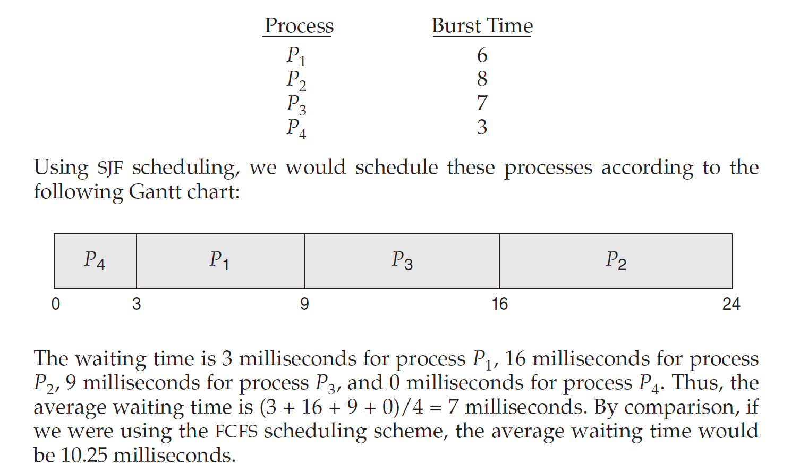
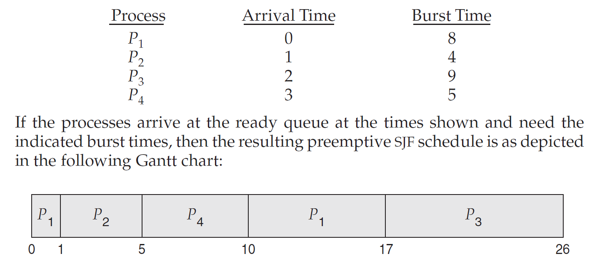

# Basic Concepts
## CPU-I/O Burst Cycle
1. An I/O-bound program typically has many short CPU bursts. A CPU-bound program might have a few long CPU bursts.

## CPU Scheduler
1. Whenever the CPU becomes idle, the operating system must select one of the processes in the ready queue to be executed. The selection process is carried out by the CPU scheduler, which selects a process from the processes in memory that are ready to execute and allocates the CPU to that process.
2. Ready Queue is not necessarily a first-in, first-out (FIFO) queue.
3. The records in the queues are generally process control blocks (PCBs) of the processes.
## Preemptive and Nonpreemptive Scheduling
1. Under nonpreemptive or cooperative scheduling, once the CPU has been allocated to a process, the process keeps the CPU until it releases it either by terminating or by switching to the waiting state. Otherwise it is preemptive scheduling.
2. Preemptive scheduling can lead to race conditions, which needs to be solved by process synchronization.
# Scheduling Criteria
1. Many Criteria have been suggested for comparing CPU-Scheduling algorithms. And they make substantial difference in which algorithm is judged to be best. They include:
    1. CPU Utilization: How many processes the CPU is executing
    2. Throughput: How many processes are completed
    3. Turnaround Time: Time taken in read queue waiting plus the execution time and any other I/O waiting.
    4. Waiting Time: CPU-Scheduling does not affect the process execution time or I/O time. So, waiting time is the time spent in ready Queue.
    5. Response Time: A process can produce some output fairly early and can continue computing new results while previous results are being output to the user. It is time when the process start responding.
    6. It is desirable to maximize CPU utilization and throughput and to minimize turnaround time, waiting time and response time.
    # Scheduling Algorithms
    1. We will first see only for single CPU core.
    ## First Come and First Served Scheduling
    1. Simplest Scheduling Algorithm with high waiting times.
    2. Has a shortcoming of Convey effect, where the small processes have to wait for long period of time for a bigger process to complete.
    3. It is nonpreemptive algorithm
    
    Grantt Chart 1
    
    Average waiting time = (0 + 24 + 27)/3 = 17ms
    Grantt Chart 2
    
    Average waiting time = (6 + 0 + 3)/3 = 3ms
    ## Shortest Job First Scheduling
    1. This algorithm associates with each process the length of the process's next CPU burst.
    2. When the CPU is available, it is assigned to the process that has the smallest next CPU burst. If the next CPU bursts of two processes are the same, FCFS scheduling is used to break the tie.
    
    3. Although the SJF algorithm is optimal, it cannot be implemented at the level of CPU scheduling, as tehre is no way to know the length of the next CPU burst.
    4. One approach to this problem is to try to approximate SJF scheduling.
    5. The next CPU burst is generally predicated as an exponential average of the measured lengths of previous CPU bursts.
    ```
    τn+1 = α tn + (1 − α)τn.
    ```
The value of tn contains our most recent information, while τn stores the past history. The parameter α controls the relative weight of recent and past history
in our prediction. If α = 0, then τn+1 = τn, and recent history has no effect
(current conditions are assumed to be transient). If α = 1, then τn+1 = tn, and
only the most recent CPU burst matters (history is assumed to be old and
irrelevant). More commonly, α = 1/2, so recent history and past history are
equally weighted. The initial τ0 can be defined as a constant or as an overall
system average.

6. The SJF Algorithm can be wither preemptive or nonpreemptive. Preemptive SJF scheduling is sometimes called shortest-remaining-time-first scheduling.

Average Waiting time = [(10-1)+(1-1)+(17-2)+(5-3)]/4 = 6.5 ms, Nonpreemptive SJF scheduling would result in an average waiting time of 7.75 ms.
## Round Robin Scheduling
1. Similar to FCFS but preemption is added to enable the system to switch between processes. A small unit of time, called a time quantum or time slice, is defined.