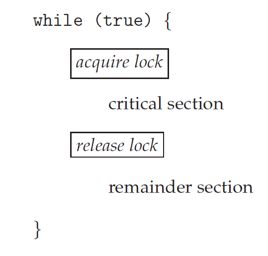

# Motivation
1. Threads often share user data. A race condition exists when access to shared data is not controlled, possibly resulting in corrupt data values.
2. Process synchronization involves using tools that control access to shared data to avoid race conditions.
3. A cooperating process is one that can affect or be affected by other processes executing in the system. They can either directly share a logical address space (both code and data) or be allowed to share data only through shared memory or message passing. Concurrent access to shared data may result in data inconsistency.
4. In this notes, we discuss various mechanisms to ensure the orderly execution of cooperating processes that share a logical address space, so that data consistency is maintained.
# Background
1. If we return to the bounded buffer example of chapter3 and modified the algorithm as:     
The code for Producer will be 

```c
while(true) {
    // Produce an item

    while(count == BUFFER_SIZE)
    ; // do nothing

    buffer[in] = next_produced;
    in = (in+1)%BUFFER_SIZE;
    count++;
}
```

The code for Consumer will be

```c
while(true) {
    while(count == 0)
    ; // do nothing

    next_consumed = buffer[out];
    out = (out+1)%BUFFER_SIZE;
    count--;

    // Consume the item
}
```

When the codes are executed concurrently they may produce surprising values for counts as either 4 or 5 or 6. The only value of 5 is correct, if the producer is producing and consumer is consuming immediately.

2. We can show that value of count may be incorrect as follows:   
The high level statement `count++` may be implemented in machine language as:
```asm
register1 = count
register1 = register + 1
count = register1
```
Similarly, for the statement `count--`
```asm
register2 = count
register2 = register2 - 1
count = register2
```
Where register1 and register2 are local CPU registers. They both can be same physical registers as well no problem, as processes use context switch to save and restore the values of registers.

3. Out of many interleaving possible one such example would be:


We arrived at this incorrect state because we allowed both processes to manipulate the variable `count` concurrently. A situation described above as race condition.

4. Because of this issue we need to study about process synchronization and coordination among cooperating processes.

# The Critical-Section Problem
1. Each process has a segment of code, called a critical section, in which the process may be accessing - and updating - data that is shared with at least one other process.
2. The important feature of the system is that, when one process is executing in its critical section, no other process is allowed to execute in its critical section. I.e. no two processes are executing in their critical sections at the same time.
3. It is designed to synchronize their activity so as to cooperatively share data.
4. Each process must request permission to enter its critical section. The section of code implementing this request is the entry section. The critical section may be followed by an exit section. The remaining code is the remainder section.


5. A solution to the critical-section problem must satisfy the following three requirements.

    1. Mutual Exclusion (one process at a time): If process P<sub>i</sub> is executing in its critical section, then no other processes can be executing in their critical section.
    2. Progress (No blocking of the other process that wants to enter critical section): If no process is executing in its critical section and some processes wish to enter their critical section, then only those processes that are not executing in their remainder sections can participate in deciding which will enter its critical section next, and this selection cannot be postponed indefinitely.
    3. Bounded waiting (fairness): There exists a bound, or limit, on the number of times that other processes are allowed to enter their critical sections after a process has made a request to enter its critical section and before that request is granted.

6. One of the earliest solutions to executing critical solution was to by disabling interrupts. But this was time consuming, since the message is passed to all the processors. This message passing delays entry into each critical section, and system efficiency decreases. Also consider how will the system clock update then if the interrupts are disabled, as it depends on the interrupts as well.

7. So, two general approaches used to handle critical sections in OS are: Preemptive Kernels and Nonpreemptive Kernels.

8. A preemptive kernel allows a process to be preempted while it is running in kernel mode. A nonpreemptive kernel does not allow a process running in kernel mode to be preempted; a kernel-mode process will run until it exits kernel mode, blocks, or voluntarily yeilds control of the CPU.

9. Nonpreemptive kernel is essentially free from race conditions on kernel data structures, as only one process is active in the kernel at a time.

10. However, Preemptive kernel is prone to race-conditions and must be designed carefully. So, why opt in favour of preemptive kernel? Well, because a preemptive kernel may be more responsive, since there is less risk that a kernel-mode process will run for an arbitrarily long period before relinquishing the processor to waiting processes. A preemptive kernel is more suitable for real-time programming, as it will allow a real-time process to preempt a process currenlty running in the kernel.

# Peterson's Solution
1. Peterson's solution satisfies all the required criteria, mutual exclusion, progress and bounded waiting.
2. Peterson's solution is restricted to two processes that alternate execution between their critical sections and remainder sections.
3. Peterson's solution requires the two processes to share two data items:
```c
int turn;
boolean flag[2];
```
4. Structure of a process in Peterson's solution:
```c
while(true) {
    flag[i] = true;
    turn = j;
    while(flag[j] && turn == j); // wait

    // critical section

    flag[i] = false;

    // remainder section
}
```
Variable `turn` indicates whose turn it is to enter its critical section. That is, if turn == i, then process P<sub>i</sub> is allowed to execute in its critical section. The `flag[2]` is used to indicate if a process is ready to enter its critical section.

5. Mechansim of Peterson's solution:
To enter the critical section, process P<sub>i</sub> must set `flag[i]` to be true and then sets `turn` to the value `j`. If both processes try to write to `turn` variable at the same time then only one of the value will last; the other will occur but will be overwritten immediately.

6. We now prove that this solution is correct.We need to show that:
    1. Mutual exclusion is preserved.
    2. The progress requirement is satisfied.
    3. The bounded-waiting requirement is met.

7. To prove property 1, we note that each Pi enters its critical section only if either `flag[j] == false` or `turn == i`. Also note that, if both processes can be executing in their critical sections at the same time, then `flag[0] == flag[1] == true`. These two observations imply that P0 and P1 could not have successfully executed their while statements at about the same time, since the value of turn can be either 0 or 1 but cannot be both. Hence, one of the processes—say, Pj—must have successfully executed the while statement, whereas Pi had to execute at least one additional statement `(“turn == j”)`. However, at that time, `flag[j] == true` and `turn == j`, and this condition will persist as long as Pj is in its critical section; as a result, mutual exclusion is preserved.

8. To prove properties 2 and 3,we note that a process Pi can be prevented from entering the critical section only if it is stuck in the while loop with the condition `flag[j] == true` and `turn == j`; this loop is the only one possible. If Pj is not ready to enter the critical section, then `flag[j] == false`, and Pi can enter its critical section. If Pj has set `flag[j]` to true and is also executing in its while statement, then either `turn == i` or `turn == j`. If `turn == i`, then Pi will enter the critical section. If `turn == j`, then Pj will enter the critical section. However, once Pj exits its critical section, it will reset `flag[j]` to false, allowing Pi to enter its critical section. If Pj resets `flag[j]` to true, it must also set turn to i. Thus, since Pi does not change the value of the variable turn while executing the while statement, Pi will enter the critical section (progress) after at most one entry by Pj (bounded waiting).

9. However, Peterson's Solution is not guaranteed to work on modern computer architectures, because the compilers may reorder read and write operations that have no dependencies.

10. Let's see how does this affects Peterson's Solution, Consider what happens if the assignments of the first two statements that appear in the entry section of Peterson's solution are reordered; it is possible that both threads may be active in their critical sections at the same time.


11. So, the only way to perserve mutual exclusion is by using proper synchronization tools. As software-based solutions don't work in this case.

# Hardware Support for Synchronization
## Memory Barriers
1. In general, a memory model falls into one of two categories:
    1. Strongly ordered, where a memory modification on one processor is immediately visible to all other processors.
    2. Weakly ordered, where modifications to memory on one processor may not be immediately visible to other processors

2. To address this issue, computer architectures provide instructions that can force any changes in memory to be propagated to all other processors, thereby ensuring that memory modifications are visible to threads running on other processors. Such instructions are known as memory barriers or memory fences.

3. When a memory barrier instruction is performed,
the system ensures that all loads and stores are completed before any subsequent
load or store operations are performed. Therefore, even if instructions
were reordered, the memory barrier ensures that the store operations are completed
in memory and visible to other processors before future load or store
operations are performed.

## Hardware Instructions
1. Many modern computer systems provide special hardware instructions that
allow us either to test and modify the content of aword or to swap the contents
of two words `atomically`—that is, as one uninterruptible unit.

2. Rather than discussing one specific instruction for one specific
machine, we abstract the main concepts behind these types of instructions by describing the `test_and_set()` and `compare_and_swap()` instructions.
```c
boolean test_and_set(boolean *target) {
    boolean rv = *target;
    *target = true;
    return rv;
}

// Let's assume lock was false in the beginning
do {
    while (test_and_set(&lock))
        ; /* do nothing */

    /* critical section */

    lock = false;

    /* remainder section */
} while (true);
```
Thus, if two `test_and_set()` instructions are executed simultaneously
(each on a different core), they will be executed sequentially in some arbitrary
order. If the machine supports the `test_and_set()` instruction, then we can
implement mutual exclusion by declaring a boolean variable `lock`, initialized
to `false`

3. The `compare_and_swap()` instruction (CAS), just like the test and set()
instruction, operates on two words atomically, but uses a different mechanism
that is based on swapping the content of two words.
```c
int compare_and_swap(int *value, int expected, int new_value) {
    int temp = *value;
    if (*value == expected)
        *value = new_value;
    return temp;
}
```

4. The CAS instruction operates on three operands. The operand `value` is set to `new_value` only if the expression `(*value == expected)` is `true`. Regardless, CAS always returns the original value of the variable `value`. The important characteristic of this instruction is that it is
executed atomically. Thus, if two CAS instructions are executed simultaneously
(each on a different core), they will be executed sequentially in some arbitrary
order.
```c
while (true) {
    while (compare_and_swap(&lock, 0, 1) != 0)
        ; /* do nothing */
    /* critical section */
    lock = 0;
    /* remainder section */
}
```
Mutual exclusion using CAS can be provided as follows: A global variable
`(lock)` is declared and is initialized to `0`. The first process that invokes
`compare_and_swap()` will set `lock` to `1`. It will then enter its critical section, because the original value of lock was equal to the expected value of 0. Subsequent
calls to `compare_and_swap()` will not succeed, because `lock` now is not
equal to the expected value of `0`.When a process exits its critical section, it sets
`lock` back to `0`, which allows another process to enter its critical section.

# Mutex Locks
1. The hardware-based solutions to the critical-section problem presented in above are complicated as well as generally inaccessible to application programmers.
Instead, operating-system designers build higher-level software
tools to solve the critical-section problem. The simplest of these tools is the
mutex lock. (In fact, the term mutex is short for mutual exclusion.)
2. We use the
mutex lock to protect critical sections and thus prevent race conditions. That
is, a process must acquire the lock before entering a critical section; it releases
the lock when it exits the critical section. The `acquire()`function acquires the
lock, and the `release()` function releases the lock.



3. A mutex lock has a boolean variable `available` whose value indicates if
the lock is available or not. If the lock is available, a call to `acquire()` succeeds,
and the lock is then considered unavailable. Aprocess that attempts to acquire
an unavailable lock is blocked until the lock is released.


4. Calls to either `acquire()` or `release()` must be performed atomically.

5. The main disadvantage of the implementation given here is that it requires
busy waiting. While a process is in its critical section, any other process that
tries to enter its critical section must loop continuously in the call to `acquire()`.
This continual looping is clearly a problem in a real multiprogramming system,
where a single CPU core is shared among many processes. Busy waiting also
wastes CPU cycles that some other process might be able to use productively.

6. The type of mutex lock we have been describing is also called a `spinlock`
because the process “spins” while waiting for the lock to become available.

7. Spinlocks do have an advantage, however, in
that no context switch is required when a process must wait on a lock, and a
context switch may take considerable time. In certain circumstances on multicore
systems, spinlocks are in fact the preferable choice for locking. If a lock is
to be held for a short duration, one thread can “spin” on one processing core
while another thread performs its critical section on another core.

> Lock Contention: A lock is considered contended if a thread blocks while trying to acquire the lock. If a lock is available when a thread attempts to acquire it, the lock is considered uncontended. Contended locks can experience either high contention (a relatively large number of threads attempting to acquire the lock) or low contention (a relatively small number of threads attempting to acquire the lock). Highly contended locks tends to decrease overall performance of concurrent applications.

8. The spinlock locking mechanism is used when the lock is to be held for a short duration. Short duration means if the lock is held for a duration of less than two context switches.

# Semaphores
1. A **semaphore** S is an integer variable that, apart from initialization, is accessed only through two standard atomic operations: `wait()` and `signal()`
2. The definition of `wait()` and `signal()` is as follows:  

`wait()`
```
wait(S) {
    while(S <= 0)
        ; // busy wait
    S--;
}
```

`signal()`
```
signal(S) {
    S++;
}
```
3. All modification to the value of `S` in `wait` and `signal` must be done atomically.
## Semaphore Usage
1. Operating Systems have two kind of semaphores: `counting` and `binary`. `counting` semaphore can range over an unrestricted domain and `binary` semaphore can range only between 0 and 1.
2. `binary` semaphore is similar to `mutex` lock. On some systems where `mutex` lock is missing `binary` semaphore is used instead for providing mutual exclusion.
3. The semaphore is first initialized to the number of available resources. Each process that wishes to use a resource performs a `wait()` operation on the semaphore (thereby decrementing the count). When a process releases a resource, it performs a `signal()` operation (incrementing the count). When the count for the semaphore goes to 0, all resources are being used. After that, processes that wish to use a resource will block until the count becomes greater than 0.
4. We can use semaphore for various synchronization problems. For example, consider two concurrently running processes: P1 with a statement S1 and P2 with a statement S2. And we require that S2 be executed only after S1 has completed. We can implement this scheme readily by letting P1 and P2 share a common semaphore `synch`, init to 0.  
So, Process P1 will be:
```
S1;
signal(synch);
```
In Process P2, we insert the statements,
```
wait(synch);
S2;
```
## Semaphore Implementation
1. When a process wants to acquire a semaphore and finds that the semaphore value is not positive, it must wait. However, rather than engaging in busy waiting, the process can suspend itself.
2. The suspend operating places a process into a waiting queue associated with the semaphore, and the state of the process is switched to the waiting state. Then control is transferred to the CPU scheduler, which selects another process to execute. A process that is suspended, waiting on a semaphore S, should be restarted when some other process excutes a `signal()` operation. The process is restarted by a `wakeup()` operation, which changes the process from waiting state to the ready state. The process is then placed in the ready queue.
3. The defintion of the semaphore will be now as follows:
```
typedef struct {
    int value;
    struct process *list;
} semaphore;
```
4. When a process must wait on a semaphore, it is added to the list of processes. A `signal()` operation removes one process from list of waiting processes and awakens that process.
5. The Definition of the `wait()` and `signal()` will be as follows:

`wait()`
```
wait(semaphore *S) {
    S->value--;
    if(S->value < 0) {
        add this process to S->list;
        sleep();
    }
}
```

`signal()`
```
signal(semaphore *S) {
    S->value++;
    if(S->value <= 0) {
        remove a process P from S->list;
        wakeup(P);
    }
}
```
6. Only this implementation of semaphore can be negative whereas the busy waiting method don't produce negative values. This effect is due to the fact of swapping the position of decrement operation and test in `wait()`
7. The list of waiting processes can be easily implemented by a link field in each process control block (PCB). Each semaphore contains an integer value and a pointer to a list of PCBs. One way to add and remove processes from the list so as to ensure bounded waiting is to use a FIFO queue, where the semaphore contains both head and tail pointers to the queue. 
6. It is important that semaphore operations be executed atomically. We must guarantee that no two processes can execute `wait()` and `signal()` operations on the same semaphore at the same time. In single core processor it is pretty straight forward to do by disabling interrupts but in multicore processor it is not that straight forward because disabling interrupts diminishs performance.
7. Therefore, SMP systems must provide alternative techniques such as `compare_and_swap()` or spinlocks to ensure that `wait()` and `signal()` are performed atomically.
8. It is important to note that we have not eliminated the busy waiting still. We have just moved it from entry section to the critical section of application programs.

# Monitors
1. The usage of semaphores is quite simple but a single mistake can lead to fatal outputs. And it will be even fataler to debug, since these erros happen only if particular execution sequences take place, and these sequences do not always occur.
2. Examples include:

    1. Incorrect order of `wait()` and `signal()`
    ```
    signal(mutex);
        ...
        critical section
        ...
    wait(mutex);
    ```
    2. Using no `signal()` at all
    ```
    wait(mutex);
        ...
        critical section
        ...
    wait(mutex);
    ```
    3. Using no `wait()` at all
    ```
    signal(mutex);
        ...
        critical section
        ...
    signal(mutex);
    ```
3. One strategy for dealing with such errors is to incorporate simple synchronization tools as high-level language constructs like `monitor`

## Monitor Usage
1. A *monitor type* is an ADT that included a set of programmer-defined operations that are provided with mutual exclusion within the monitor. The monitor type also declares the variables whose values define the state of an instance of that type, along with the bodies of functions that operate on those variables.
2. Syntax of a monitor type is:
```
monitor monitor name
{
    /* shared variable declarations */
    function P1(...) {
        ...
    }
    .
    .
    .
    function Pn(...) {
        ...
    }

    initialization_code(...) {
        ...
    }
}
```
3. Apart from the Monitor ADT, the high level languages also provide variables of type *condition*
```
condition x, y;
```

The only operations that can be invoked on a condition variable are `wait()` and `signal()` such as, `x.wait()` and `x.signal()`


4. The `x.signal()` operation resumes exactly one suspended process. If no process is suspended, then `signal()` operation has no effect; that is, the state of `x` is the same as if the operation had never been executed.  However, with the classical semaphores, `signal()` always affects the state of the semaphore.

5. **When `x.signal()` operation is invoked by a process P, there exists a suspended process Q associated with condition x. Clearly, if the suspended process Q is allowed to resume its execution, the signaling process P must wait.**

However, there can be conceptually two possibilities:
1. **Signal and wait**. P either waits until Q leaves the monitor or waits for another condition.
2. **Signal and continue**. Q either waits until P leaves the monitor or waits for another condition.

## Implementing a Monitor Using Semaphores
1. Since a signaling process must wait until the resumed process either leaves or waits, an additional binary semaphore, `next`, is introduced, initialized to 0.
2. The signaling processes can use `next` to suspend themselves.
3. An integer variable `next_count` is also provided to count the number of processes suspended on `next`. Thus, each external function `F` is replaced by:
```
wait(mutex);
    ...
    body of F
    ...
    if(next_count > 0)
        signal(next);
    else
        signal(mutex);
```
4. Implementation of condition variables. For each condition x, we introduce a binary semaphore `x_sem` and an integer variable `x_count`, both initialized to 0. 

The operation `x.wait()` can now be implemented as,
```
x_count++;
if(next_count > 0)
    signal(next);
else
    signal(mutex);
wait(x_sem);
x_count--;
```

The operation `x.signal()` can be implemented as,
```
if(x_count > 0) {
    next_count++;
    signal(x_sem);
    wait(next);
    next_count--;
}
```
## Resuming Processes within a Monitor
1. One simple solution is to use a first-come, first-served (FCFS) ordering, so that the process that has been waiting the longest is resumed first.
2. In many circumstances, the **conditional-wait** construct can be used. This construct has the form `x.wait(c)`, where `c` is an integer expression that is evaluated when the `wait()` operation is executed. 
3. The value of `c`, which is called a **priority number**, is then stored with the name of the process that is suspended. When `x.signal()` is executed, the process with the smallest priority number is resumed next.
4. Example illustration of `ResourceAllocator`:
```
monitor ResourceAllocator
{
    boolean busy;
    condition x;

    void acquire(int time) {
        if(busy)
            x.wait(time);
        busy = true;
    }

    void release() {
        busy = false;
        x.signal();
    }

    initialization_code() {
        busy = false;
    }
}
```
5. Each process, when requesting an allocation of this resource, specifies the maximum time it plans to use the resource. The monitor allocates the resource to the process that has the shortest time-allocation request.
6. Example program using the `ResourceAllocator`
```
R.acquire(t);
    ...
    access the resource;
    ...
R.release();
```
Where `R` is an instance of type `ResourceAllocator`.
7. However, we again come back to the same question that we asked when we were designing the monitor, what if the programmer again doesn't write these functions in the sequence. To do so, we must check two conditions to the establish the correctness of this system.
    1. User processes must always make their calls on the monitor in a correct sequence.
    2. We must be sure that an uncooperative process does not simply ignore the mutual-exclusion gateway provided by the monitor and try to access the shared resource directly, without using the access protocols.
# Liveness
1. One consequence of using synchronization tools to coordinate access to critical sections is the possibility that a process attempting to enter its critical section will wait indefinitely. Idefinite waiting violates two of these-- the progress and bounded-waiting criteria.
2. **Liveness** refers to a set of properties that a system must satisfy to ensure that processes make progress during their execution life cycle. A process waiting indefinitely under the circumstances is an example of a "liveness failure".
## Deadlock
1. The implementation of a semaphore with a waiting queue may result in a situation where two or more processes are waiting indefinitely for an event that can be caused only by one of the waiting processes. The event is question is the execution of a `signal()` operation. When such a state is reached, these processes are said to be **deadlocked**.
2. To illustrate this, consider a system consisting of two processes, P0 and P1, each accessing two semaphores, S and Q, set to the value 1:   

3. We say that a set of processes is in a deadlocked state when *every process in the set of waiting for an event that can be caused only by another process in the set.*
## Priority Inversion
1. A scheduling challenge arises when a higher-priority process neeeds to read or modify kernel data that are currently being accessed by a lower-priority process -- or a chain of lower-priority processes.
2. Let's assume three processes -- L, M, and H whose priorities follow the order L < M < H. Ordinarily, process H would wait for L to finish using resource S. However, now suppose that process M becomes runnable, thereby preempting process L. Indirectly, a process with a lower priority, process M, has affected how long process H must wait for L to relinquish resource S. This liveness problem is known as **priority inversion**, and it can occur only in systems with more than two priorities.
3. Typically, priority inversion is avoided by implementing a **priority-inheritance protocol**. 
4. According to this protocol, all processes that are accessing resources needed by a higher-priority process inherit the higher priority until they are finished with the resources in question. When they are finished, their priorities revert to their original values.
5. In the example above, a priority-inheritance protocol would allow process L to temporarily inherit the priority of process H, thereby preventing process M from preempting its execution. When process L had finished using resource S, it would relinquish its inherited priority from H and assume its original priority. Because resource S would now be available, process H -- not M -- would run next.

