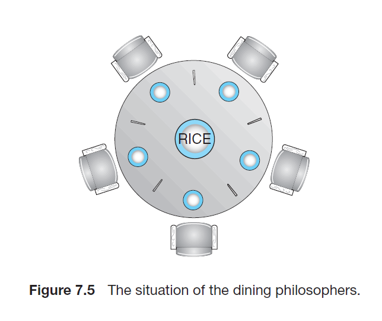

# Classical Problems of Synchronization
## The Bounded-Buffer Problem
1. The producer and consumer processes share the following data structures:
```cpp
int n;
semaphore mutex = 1;
semaphore empty = n;
semaphore full = 0;
```
2. Code for Producer and Consumer are as follows:

```cpp
while(true) {
    ...
    /* produce an item in next_produced */
    ...
    wait(empty);
    wait(mutex);
    ...
    /* add next_produced to the buffer */
    ...
    signal(mutex);
    signal(full);
}
```
The structure of the producer process
```cpp
while(true) {
    wait(full);
    wait(mutex);
    ...
    /* remove an item from buffer to next_consumed */
    ...
    signal(mutex);
    signal(empty);
    ...
    /* consume the item in next_consumed */
    ...
}
```
The structure of the consumer process
## The Readers-Writers Problem
1. The readers-writers problem has several variations, all involving priorities. The simplest one, referred to as the first readers-writers problem, requires that no reader be kept waiting unless a writer has alread obtained permission to use the shared object. In other words, no reader should wait for other readers to finish simply because a writer is waiting.
2. The second readers-writers problem requires that, once a writer is ready, that writer perform its write as soon as possible. In other words, if a writer is waiting to access the object, no new readers may start reading.
3. A solution to either problem may result in starvation. In first case, writers may starve; in the second case, readers may starve.
4. First solution to readers-writers problem with starvation.
```cpp
semaphore rw_mutex = 1;
semaphore mutex = 1;
int read_count = 0;
```
5. Code for writers and readers
```cpp
while(true) {
    wait(rw_mutex);
    ...
    /* writing is performed */
    ...
    signal(rw_mutex);
}
```
The structure of a writer process
```cpp
while(true) {
    wait(mutex);
    read_count++;
    if(read_count == 1)
        wait(rw_mutex);
    signal(mutex);
    ...
    /* reading is performed */
    ...
    wait(mutex);
    read_count--;
    if(read_count == 0)
        signal(rw_mutex);
    signal(mutex);
}
```
The structure of a reader process
## The Dining-Philosophers Problem

1. The code structure of Dining Philosophers Problem:
```cpp
while(true) {
    wait(chopstick[i]);
    wait(chopstick[(i+1)%5]);
    ...
    /* eat for a while */
    ...
    signal(chopstick[i]);
    signal(chopstick[(i+1)%5]);
    ...
    /* think for awhile */
    ...
}
```
2. The dining-philosophers problem is considered a classic synchronization problem neither because of its practical importance nor because computer scientists dislike philosophers but because it is an example of a large class of concurrency-control problems. It is a simple representation of the need to allocate several resources among several processes in a deadlock-free and starvation-free manner.
3. A simple naive solution could be to use semaphores of chopsticks as `semaphore chopstick[5];` where all the elements of chopstick are initialized to 1. 
4. Although this solution guarantees that no two neighbors are eating simultaneously, it nevertheless must be rejected because it could create a deadlock. Because if all the philosophers grab the left chopstick then the philosophers couldn't grab their right chopstick and hence they will be stuck forever.
5. Possible remedies to the deadlock problem are the following:
    1. Allow at most four philosophers to be sitting simultaneously at the table.
    2. Allow a philosopher to pick up her chopsticks only if both chopsticks are available (critical section part)
    3. Use an asymmetric solution -- that is, an odd-numbered philosopher picks up first her left chopstick and then her right chopstick, whereas an even-numbered philosopher picks up her right chopstick and then her left chopstick.