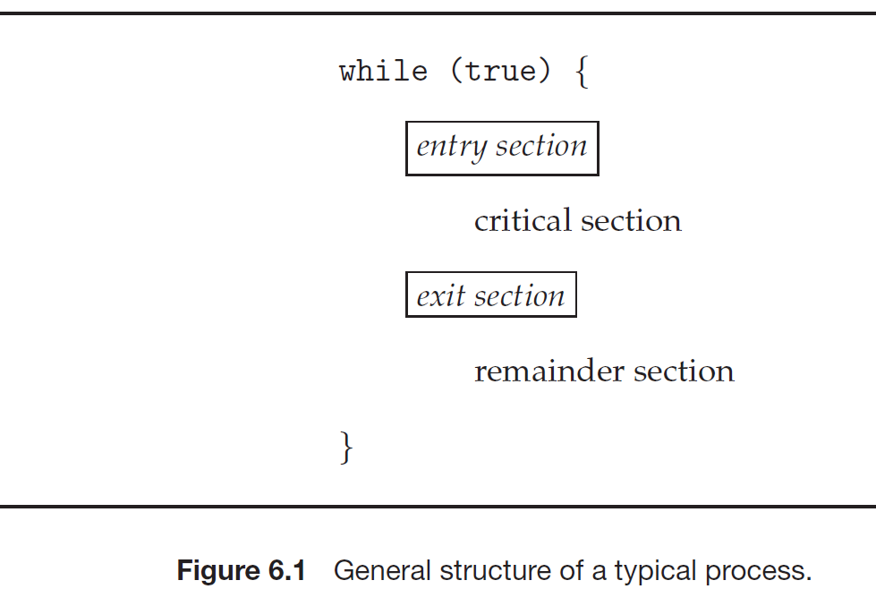

# Motivation
1. Threads often share user data. A race condition exists when access to shared data is not controlled, possibly resulting in corrupt data values.
2. Process synchronization involves using tools that control access to shared data to avoid race conditions.
3. A cooperating process is one that can affect or be affected by other processes executing in the system. They can either directly share a logical address space (both code and data) or be allowed to share data only through shared memory or message passing. Concurrent access to shared data may result in data inconsistency.
4. In this notes, we discuss various mechanisms to ensure the orderly execution of cooperating processes that share a logical address space, so that data consistency is maintained.
# Background
1. If we return to the bounded buffer example of chapter3 and modified the algorithm as:     
The code for Producer will be 

```c
while(true) {
    // Produce an item

    while(count == BUFFER_SIZE)
    ; // do nothing

    buffer[in] = next_produced;
    in = (in+1)%BUFFER_SIZE;
    count++;
}
```

The code for Consumer will be

```c
while(true) {
    while(count == 0)
    ; // do nothing

    next_consumed = buffer[out];
    out = (out+1)%BUFFER_SIZE;
    count--;

    // Consume the item
}
```

When the codes are executed concurrently they may produce surprising values for counts as either 4 or 5 or 6. The only value of 5 is correct, if the producer is producing and consumer is consuming immediately.

2. We can show that value of count may be incorrect as follows:   
The high level statement `count++` may be implemented in machine language as:
```asm
register1 = count
register1 = register + 1
count = register1
```
Similarly, for the statement `count--`
```asm
register2 = count
register2 = register2 - 1
count = register2
```
Where register1 and register2 are local CPU registers. They both can be same physical registers as well no problem, as processes use context switch to save and restore the values of registers.

3. Out of many interleaving possible one such example would be:


We arrived at this incorrect state because we allowed both processes to manipulate the variable `count` concurrently. A situation described above as race condition.

4. Because of this issue we need to study about process synchronization and coordination among cooperating processes.

# The Critical-Section Problem
1. Each process has a segment of code, called a critical section, in which the process may be accessing - and updating - data that is shared with at least one other process.
2. The important feature of the system is that, when one process is executing in its critical section, no other process is allowed to execute in its critical section. I.e. no two processes are executing in their critical sections at the same time.
3. It is designed to synchronize their activity so as to cooperatively share data.
4. Each process must request permission to enter its critical section. The section of code implementing this request is the entry section. The critical section may be followed by an exit section. The remaining code is the remainder section.



5. A solution to the critical-section problem must satisfy the following three requirements.

    1. Mutual Exclusion (one process at a time): If process P<sub>i</sub> is executing in its critical section, then no other processes can be executing in their critical section.
    2. Progress (No blocking of the other process that wants to enter critical section): If no process is executing in its critical section and some processes wish to enter their critical section, then only those processes that are not executing in their remainder sections can participate in deciding which will enter its critical section next, and this selection cannot be postponed indefinitely.
    3. Bounded waiting (fairness): There exists a bound, or limit, on the number of times that other processes are allowed to enter their critical sections after a process has made a request to enter its critical section and before that request is granted.

6. One of the earliest solutions to executing critical solution was to by disabling interrupts. But this was time consuming, since the message is passed to all the processors. This message passing delays entry into each critical section, and system efficiency decreases. Also consider how will the system clock update then if the interrupts are disabled, as it depends on the interrupts as well.

7. So, two general approaches used to handle critical sections in OS are: Preemptive Kernels and Nonpreemptive Kernels.

8. A preemptive kernel allows a process to be preempted while it is running in kernel mode. A nonpreemptive kernel does not allow a process running in kernel mode to be preempted; a kernel-mode process will run until it exits kernel mode, blocks, or voluntarily yeilds control of the CPU.

9. Nonpreemptive kernel is essentially free from race conditions on kernel data structures, as only one process is active in the kernel at a time.

10. However, Preemptive kernel is prone to race-conditions and must be designed carefully. So, why opt in favour of preemptive kernel? Well, because a preemptive kernel may be more responsive, since there is less risk that a kernel-mode process will run for an arbitrarily long period before relinquishing the processor to waiting processes. A preemptive kernel is more suitable for real-time programming, as it will allow a real-time process to preempt a process currenlty running in the kernel.

# Peterson's Solution
1. Peterson's solution satisfies all the required criteria, mutual exclusion, progress and bounded waiting.
2. Peterson's solution is restricted to two processes that alternate execution between their critical sections and remainder sections.
3. Peterson's solution requires the two processes to share two data items:
```c
int turn;
boolean flag[2];
```
4. Structure of a process in Peterson's solution:
```c
while(true) {
    flag[i] = true;
    turn = j;
    while(flag[j] && turn == j); // wait

    // critical section

    flag[i] = false;

    // remainder section
}
```
Variable `turn` indicates whose turn it is to enter its critical section. That is, if turn == i, then process P<sub>i</sub> is allowed to execute in its critical section. The `flag[2]` is used to indicate if a process is ready to enter its critical section.

5. Mechansim of Peterson's solution:
To enter the critical section, process P<sub>i</sub> must set `flag[i]` to be true and then sets `turn` to the value `j`. If both processes try to write to `turn` variable at the same time then only one of the value will last; the other will occur but will be overwritten immediately.

6. We now prove that this solution is correct.We need to show that:
    1. Mutual exclusion is preserved.
    2. The progress requirement is satisfied.
    3. The bounded-waiting requirement is met.

7. To prove property 1, we note that each Pi enters its critical section only if either `flag[j] == false` or `turn == i`. Also note that, if both processes can be executing in their critical sections at the same time, then `flag[0] == flag[1] == true`. These two observations imply that P0 and P1 could not have successfully executed their while statements at about the same time, since the value of turn can be either 0 or 1 but cannot be both. Hence, one of the processes—say, Pj—must have successfully executed the while statement, whereas Pi had to execute at least one additional statement `(“turn == j”)`. However, at that time, `flag[j] == true` and `turn == j`, and this condition will persist as long as Pj is in its critical section; as a result, mutual exclusion is preserved.

8. To prove properties 2 and 3,we note that a process Pi can be prevented from entering the critical section only if it is stuck in the while loop with the condition `flag[j] == true` and `turn == j`; this loop is the only one possible. If Pj is not ready to enter the critical section, then `flag[j] == false`, and Pi can enter its critical section. If Pj has set `flag[j]` to true and is also executing in its while statement, then either `turn == i` or `turn == j`. If `turn == i`, then Pi will enter the critical section. If `turn == j`, then Pj will enter the critical section. However, once Pj exits its critical section, it will reset `flag[j]` to false, allowing Pi to enter its critical section. If Pj resets `flag[j]` to true, it must also set turn to i. Thus, since Pi does not change the value of the variable turn while executing the while statement, Pi will enter the critical section (progress) after at most one entry by Pj (bounded waiting).

9. However, Peterson's Solution is not guaranteed to work on modern computer architectures, because the compilers may reorder read and write operations that have no dependencies.

10. Let's see how does this affects Peterson's Solution, Consider what happens if the assignments of the first two statements that appear in the entry section of Peterson's solution are reordered; it is possible that both threads may be active in their critical sections at the same time.


11. So, the only way to perserve mutual exclusion is by using proper synchronization tools. As software-based solutions don't work in this case.

# Hardware Support for Synchronization
## Memory Barriers
1. In general, a memory model falls into one of two categories:
    1. Strongly ordered, where a memory modification on one processor is immediately visible to all other processors.
    2. Weakly ordered, where modifications to memory on one processor may not be immediately visible to other processors

2. To address this issue, computer architectures provide instructions that can force any changes in memory to be propagated to all other processors, thereby ensuring that memory modifications are visible to threads running on other processors. Such instructions are known as memory barriers or memory fences.

3. When a memory barrier instruction is performed,
the system ensures that all loads and stores are completed before any subsequent
load or store operations are performed. Therefore, even if instructions
were reordered, the memory barrier ensures that the store operations are completed
in memory and visible to other processors before future load or store
operations are performed.

## Hardware Instructions
1. Many modern computer systems provide special hardware instructions that
allow us either to test and modify the content of aword or to swap the contents
of two words `atomically`—that is, as one uninterruptible unit.

2. Rather than discussing one specific instruction for one specific
machine, we abstract the main concepts behind these types of instructions by describing the `test_and_set()` and `compare_and_swap()` instructions.
```c
boolean test_and_set(boolean *target) {
    boolean rv = *target;
    *target = true;
    return rv;
}

// Let's assume lock was false in the beginning
do {
    while (test_and_set(&lock))
        ; /* do nothing */

    /* critical section */

    lock = false;

    /* remainder section */
} while (true);
```
Thus, if two `test_and_set()` instructions are executed simultaneously
(each on a different core), they will be executed sequentially in some arbitrary
order. If the machine supports the `test_and_set()` instruction, then we can
implement mutual exclusion by declaring a boolean variable `lock`, initialized
to `false`

3. The `compare_and_swap()` instruction (CAS), just like the test and set()
instruction, operates on two words atomically, but uses a different mechanism
that is based on swapping the content of two words.
```c
int compare_and_swap(int *value, int expected, int new_value) {
    int temp = *value;
    if (*value == expected)
        *value = new_value;
    return temp;
}
```

4. The CAS instruction operates on three operands. The operand `value` is set to `new_value` only if the expression `(*value == expected)` is `true`. Regardless, CAS always returns the original value of the variable `value`. The important characteristic of this instruction is that it is
executed atomically. Thus, if two CAS instructions are executed simultaneously
(each on a different core), they will be executed sequentially in some arbitrary
order.
```c
while (true) {
    while (compare_and_swap(&lock, 0, 1) != 0)
        ; /* do nothing */
    /* critical section */
    lock = 0;
    /* remainder section */
}
```
Mutual exclusion using CAS can be provided as follows: A global variable
`(lock)` is declared and is initialized to `0`. The first process that invokes
`compare_and_swap()` will set `lock` to `1`. It will then enter its critical section, because the original value of lock was equal to the expected value of 0. Subsequent
calls to `compare_and_swap()` will not succeed, because `lock` now is not
equal to the expected value of `0`.When a process exits its critical section, it sets
`lock` back to `0`, which allows another process to enter its critical section.

# Mutex Locks
1. The hardware-based solutions to the critical-section problem presented in above are complicated as well as generally inaccessible to application programmers.
Instead, operating-system designers build higher-level software
tools to solve the critical-section problem. The simplest of these tools is the
mutex lock. (In fact, the term mutex is short for mutual exclusion.)
2. We use the
mutex lock to protect critical sections and thus prevent race conditions. That
is, a process must acquire the lock before entering a critical section; it releases
the lock when it exits the critical section. The `acquire()`function acquires the
lock, and the `release()` function releases the lock.


3. A mutex lock has a boolean variable `available` whose value indicates if
the lock is available or not. If the lock is available, a call to `acquire()` succeeds,
and the lock is then considered unavailable. Aprocess that attempts to acquire
an unavailable lock is blocked until the lock is released.


4. Calls to either `acquire()` or `release()` must be performed atomically.

5. The main disadvantage of the implementation given here is that it requires
busy waiting. While a process is in its critical section, any other process that
tries to enter its critical section must loop continuously in the call to `acquire()`.
This continual looping is clearly a problem in a real multiprogramming system,
where a single CPU core is shared among many processes. Busy waiting also
wastes CPU cycles that some other process might be able to use productively.

6. The type of mutex lock we have been describing is also called a `spinlock`
because the process “spins” while waiting for the lock to become available.

7. Spinlocks do have an advantage, however, in
that no context switch is required when a process must wait on a lock, and a
context switch may take considerable time. In certain circumstances on multicore
systems, spinlocks are in fact the preferable choice for locking. If a lock is
to be held for a short duration, one thread can “spin” on one processing core
while another thread performs its critical section on another core.